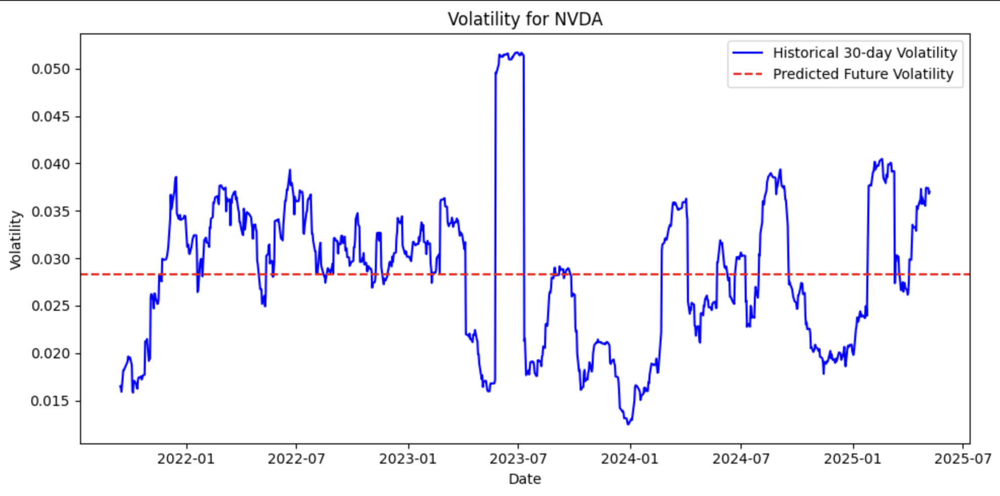
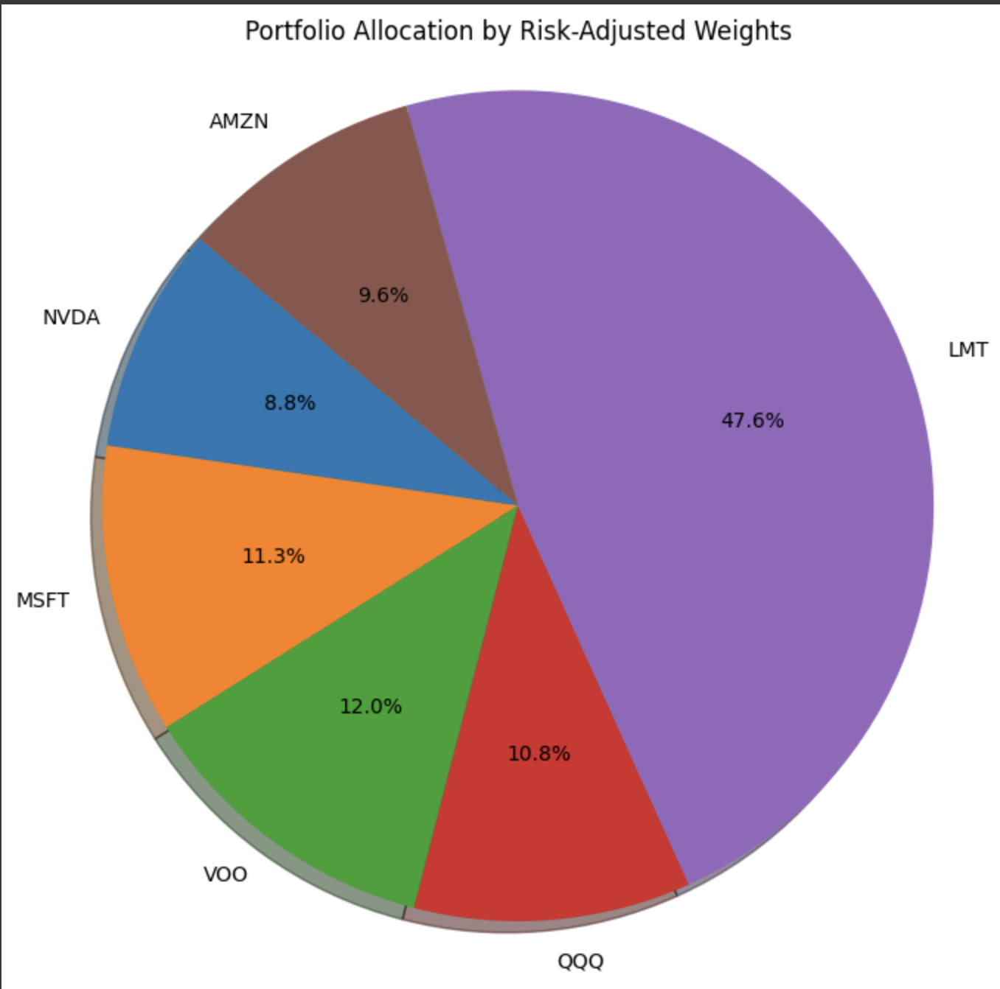
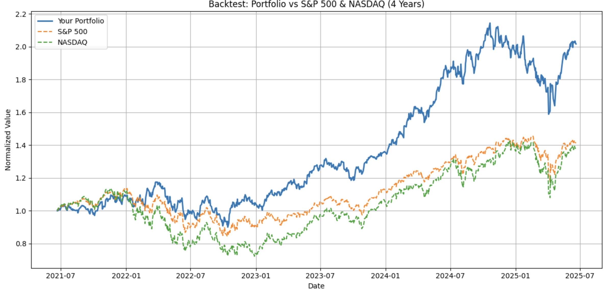

# 📊 LSTM-Based Portfolio Risk Optimization

This project predicts future stock volatility using Long Short-Term Memory (LSTM) neural networks and recommends portfolio allocations based on user-defined risk preferences. It includes performance backtesting against benchmarks like the S&P 500 and NASDAQ.

---

## 🚀 Overview

The system helps investors build a personalized stock portfolio by:
- Predicting future volatility for selected stocks using deep learning
- Calculating beta and risk-adjusted scores
- Recommending asset allocations tailored to user risk levels
- Visualizing portfolio performance and risk via charts and backtesting

---

## 🧠 Features

- 📈 **Volatility Forecasting**  
  Uses a multi-layer LSTM model to predict 30-day forward volatility based on historical price, returns, volume, and rolling stats.

- 🧮 **Risk Scoring**  
  Combines predicted volatility and historical beta to compute a risk score for each stock.

- 🎯 **Portfolio Recommendation**  
  Allocates capital based on user-defined risk level (1–5) using an adaptive weighting formula.

- 📊 **Backtesting**  
  Compares your portfolio's performance with the S&P 500 (`^GSPC`) and NASDAQ (`^IXIC`) over a 4-year horizon.

- 📎 **Interactive CLI**  
  Users can build a portfolio interactively via terminal prompts.

---

## 🧰 Tech Stack

- **Python**, `NumPy`, `Pandas`
- **LSTM (Keras + TensorFlow)**
- **yFinance** for data retrieval
- **Matplotlib** for visualization
- **Scikit-learn** for preprocessing

---

## 📷 Example Output


> Visualization of predicted vs. historical volatility.


> Portfolio allocation based on calculated risk-adjusted scores.


> Portfolio Backtesting vs Benchmarks

---

## 🛠 How to Run

1. Clone the repo:
   ```bash
   git clone https://github.com/ncharron99/LSTM-Based-Portfolio-Risk-Optimization.git
   cd LSTM-Based-Portfolio-Risk-Optimization
